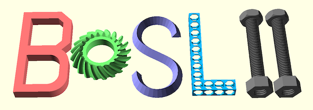

# BOSL2

**The Belfry OpenScad Library, v2**

A library for OpenSCAD, filled with useful tools, shapes, masks, math and manipulators, designed to make OpenSCAD easier to use.

Requires OpenSCAD 2021.01 or later.

- **NOTE:** BOSL2 IS BETA CODE.  THE CODE IS STILL BEING REORGANIZED.
- **NOTE2:** CODE WRITTEN FOR BOSLv1 WON'T WORK WITH BOSL2!

The BOSL2 library is an enormous library that provides many different kinds of capabilities to simplify the development of models in OpenSCAD, and to make things possible that are difficult in native OpenSCAD.  Some of the things BOSL2 provides are:

* **Attachments.**  Unless you make models containing just one object, the attachments features can revolutionize your modeling.  They let you position components of a model relative to other components so you don't have to keep track of the positions and orientations of parts of the model.  You can instead place something on the TOP of something else, perhaps aligned to the RIGHT.  For a full introduction to attachments, consult the [Attachments Tutorial.](https://github.com/BelfrySCAD/BOSL2/wiki/Tutorial-Attachment-Overview)
* **Rounding and filleting.**  Rounding and filleting is hard in OpenSCAD.  The library provides modules like [cuboid()](https://github.com/BelfrySCAD/BOSL2/wiki/shapes3d.scad#module-cuboid) to make a cube with any of the edges rounded, [offset_sweep()](https://github.com/BelfrySCAD/BOSL2/wiki/rounding.scad#functionmodule-offset_sweep) to round the ends of a linear extrusion, and [prism_connector()](https://github.com/BelfrySCAD/BOSL2/wiki/rounding.scad#module-prism_connector) which works with the attachments feature to create filleted prisms between a variety of objects, or holes through a single object with rounded edges at the ends.  You can also use [edge_profile()](https://github.com/BelfrySCAD/BOSL2/wiki/attachments.scad#module-edge_profile) to apply a variety of different mask profiles to chosen edges of a cubic shape, or you can directly subtract 3d mask shapes from an edge of objects that are not cubes.
* **Shorthands.** The shorthands make your code a little shorter, and more importantly, they can make it significantly easier to read.  Compare `up(z)` to `translate([0,0,z])`.  The shorthands include operations for creating [copies of objects](https://github.com/BelfrySCAD/BOSL2/wiki/distributors.scad) and for applying [transformations](https://github.com/BelfrySCAD/BOSL2/wiki/transforms.scad) to objects, including [rot()](https://github.com/BelfrySCAD/BOSL2/wiki/transforms.scad#functionmodule-rot) which extends `rotate()` in some useful ways that are not easy to do directly. 
* **Complex object support.**  The [path_sweep()](https://github.com/BelfrySCAD/BOSL2/wiki/skin.scad#functionmodule-path_sweep) function/module takes a 2d polygon moves it through space along a path and sweeps out a 3d shape as it moves.  You can link together a series of arbitrary polygons with [skin()](https://github.com/BelfrySCAD/BOSL2/wiki/skin.scad#functionmodule-skin) or [vnf_vertex_array().](https://github.com/BelfrySCAD/BOSL2/wiki/vnf.scad#functionmodule-vnf_vertex_array)  Support for [beziers](https://github.com/BelfrySCAD/BOSL2/wiki/beziers.scad) and [NURBS](https://github.com/BelfrySCAD/BOSL2/wiki/nurbs.scad) can help you construct the building blocks you need.  [Metaballs](https://github.com/BelfrySCAD/BOSL2/wiki/isosurface.scad#functionmodule-metaballs) can create organic surfaces that blend shapes together.  
* **Building Blocks.** OpenSCAD provides cubes, cones and spheres.  The BOSL2 library extends this to provide different kinds of prisms, tubes, and other abstract geometrical building blocks. In many cases the BOSL2 objects include options to round their edges.  Basic objects have extensions like the ability to specify the **inner** radius of a circle to create holes with a guaranteed minimum size.  
* **Texturing.**  Many kinds of objects can be created with [textures](https://github.com/BelfrySCAD/BOSL2/wiki/skin.scad#section-texturing) applied.  This can create knurling, but it can do much more than that.  A texture can be any repeating pattern, and applying a texture can actually replace the base object with something different based on repeating copies of the texture element.  A texture can also be an image; using texturing you can emboss an arbitrary image onto your model. 
* **Parts library.**  The parts library includes many useful specific functional parts including [gears](https://github.com/BelfrySCAD/BOSL2/wiki/gears.scad), generic [threading](https://github.com/BelfrySCAD/BOSL2/wiki/threading.scad#section-generic-threading), and specific threading to match plastic [bottles](https://github.com/BelfrySCAD/BOSL2/wiki/bottlecaps.scad), [pipe fittings](https://github.com/BelfrySCAD/BOSL2/wiki/threading.scad#module-npt_threaded_rod), or standard [screws.](https://github.com/BelfrySCAD/BOSL2/wiki/screws.scad)  Also included are [clips](https://github.com/BelfrySCAD/BOSL2/wiki/joiners.scad#section-tension-clips), [hinges](https://github.com/BelfrySCAD/BOSL2/wiki/hinges.scad), and [dovetail joints.](https://github.com/BelfrySCAD/BOSL2/wiki/joiners.scad#section-dovetails)
* **Geometrical operations on curves**  In OpenSCAD, geometrical operations happen on geometry, and information can never be extracted from geometry.  The BOLS2 library provides operations on 2d point lists (called "paths" or "regions") to make [rounded paths](https://github.com/BelfrySCAD/BOSL2/wiki/rounding.scad#function-round_corners) from ones with corners or do operations like [intersection](https://github.com/BelfrySCAD/BOSL2/wiki/regions.scad#functionmodule-intersection) and [offset](https://github.com/BelfrySCAD/BOSL2/wiki/regions.scad#function-offset).  It can also do some limited operations on three dimensional data.
* **Geometrical operations on polyhedra** Openscad describes a polyhedron using a list of vertices and faces, which BOSL2 refers to as a VNF (for Vertices 'N' Faces).  When working directly with polyhedra it is tedious to ensure a valid result.  The library provides tools to create VNFs that are guaranteed to be valid, and it offers some limited geometrical operations on VNFs.  
* **Programming aids.** The library provides basic [mathematical operations](https://github.com/BelfrySCAD/BOSL2/wiki/math.scad) including solutions to [linear systems of equations](https://github.com/BelfrySCAD/BOSL2/wiki/linalg.scad#function-linear_solve) and [generic](https://github.com/BelfrySCAD/BOSL2/wiki/math.scad#function-root_find) and [polynomial](https://github.com/BelfrySCAD/BOSL2/wiki/math.scad#function-real_roots) numerical root finding.  It provides [geometrical operations](https://github.com/BelfrySCAD/BOSL2/wiki/geometry.scad) like [line intersection](https://github.com/BelfrySCAD/BOSL2/wiki/geometry.scad#function-line_intersection) or [circle intersection](https://github.com/BelfrySCAD/BOSL2/wiki/geometry.scad#function-circle_circle_intersection), [coordinate transformations](https://github.com/BelfrySCAD/BOSL2/wiki/coords.scad), [string manipulation,](https://github.com/BelfrySCAD/BOSL2/wiki/strings.scad) and [list processing](https://github.com/BelfrySCAD/BOSL2/wiki/lists.scad).   

## Documentation

You can find the full BOSL2 library documentation at: https://github.com/BelfrySCAD/BOSL2/wiki

## Installation

1. Download the .zip or .tar.gz release file for this library.  Currently you should be able to find this at https://github.com/BelfrySCAD/BOSL2/archive/refs/heads/master.zip
2. Unpack it. Make sure that you unpack the whole file structure. Some zipfile unpackers call this option "Use folder names". It should create either a `BOSL-v2.0` or `BOSL2-master` directory with the library files within it.  You should see "examples", "scripts", "tests", and other subdirectories.
3. Rename the unpacked main directory to `BOSL2`.
4. Move the `BOSL2` directory into the apropriate OpenSCAD library directory.  The library directory may be on the list below, but for SNAP or other prepackaged installations, it is probably somewhere else.  To find it, run OpenSCAD and select Help&rarr;Library Info, and look for the entry that says "User Library Path".  This is your default library directory.  You may choose to change it to something more convenient by setting the environment variable OPENSCADPATH.  Using this variable also means that all versions of OpenSCAD you install will look for libraries in the same location.  
    - Windows: `My Documents\OpenSCAD\libraries\`
    - Linux: `$HOME/.local/share/OpenSCAD/libraries/`
    - Mac OS X: `$HOME/Documents/OpenSCAD/libraries/`
5. Restart OpenSCAD.

## Examples
A lot of the features of this library are to allow shorter, easier-to-read, intent-based coding.  For example:

[`BOSL2/transforms.scad`](https://github.com/BelfrySCAD/BOSL2/wiki/transforms.scad) Examples | Raw OpenSCAD Equivalent
------------------------------- | -------------------------------
`up(5)`                         | `translate([0,0,5])`
`xrot(30,cp=[0,10,20])`         | `translate([0,10,20]) rotate([30,0,0]) translate([0,-10,-20])`
`xcopies(20,n=3)`               | `for (dx=[-20,0,20]) translate([dx,0,0])`
`zrot_copies(n=6,r=20)`         | `for (zr=[0:5]) rotate([0,0,zr*60]) translate([20,0,0])`
`skew(sxz=0.5,syz=0.333)`       | `multmatrix([[1,0,0.5,0],[0,1,0.333,0],[0,0,1,0],[0,0,0,1]])`

[`BOSL2/shapes.scad`](https://github.com/BelfrySCAD/BOSL2/wiki/shapes3d.scad) Examples | Raw OpenSCAD Equivalent
---------------------------------- | -------------------------------
`cube([10,20,30], anchor=BOTTOM);` | `translate([0,0,15]) cube([10,20,30], center=true);`
`cuboid([20,20,30], rounding=5);`  | `minkowski() {cube([10,10,20], center=true); sphere(r=5, $fn=32);}`
`prismoid([30,40],[20,30],h=10);`  | `hull() {translate([0,0,0.005]) cube([30,40,0.01], center=true); translate([0,0,9.995]) cube([20,30,0.01],center=true);}`
`xcyl(l=20,d=4);`                  | `rotate([0,90,0]) cylinder(h=20, d=4, center=true);`
`cyl(l=100, d=40, rounding=5);`    | `minkowski() {cylinder(h=90, d=30, center=true); sphere(r=5);}`
`tube(od=40,wall=5,h=30);`         | `difference() {cylinder(d=40,h=30,center=true); cylinder(d=30,h=31,center=true);}`
`torus(d_maj=100, d_min=30);`      | `rotate_extrude() translate([50,0,0]) circle(d=30);`

